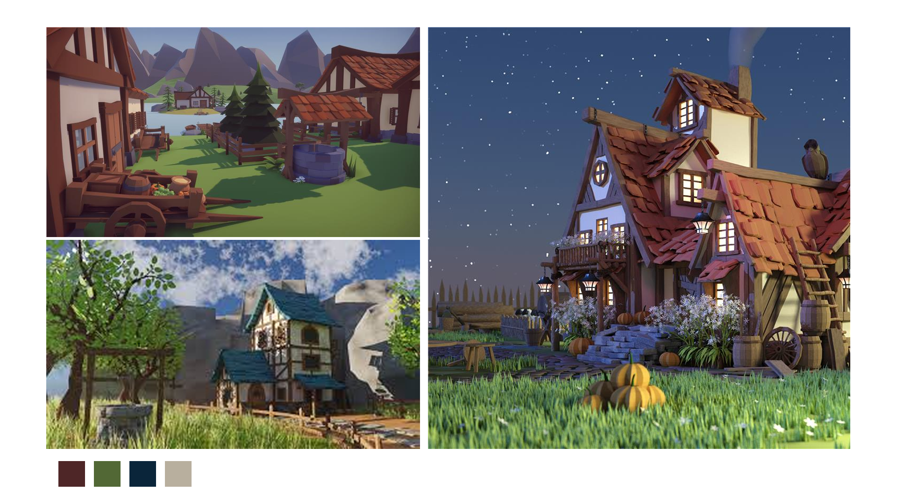

# travail_3_realiter_mixte
travail 3 realiter mixte, Lucas Bonneau, Jérémy Theriault, Zackary Warren

## Description du projet
Jeu en réalité virtuel qui se passe à l'époque médiéval, le but sera d'aller porter des lettres au paysans pour gagner de l'argent et se rendre au chateau du roi.

## Proposition
 - La première mechanique sera les lettres scellées, si une lettre est scellée le joueur aura la possibilité (après avoir acheter un objet pour déscellée) d'ouvrir la carte dans les lettres fermée il y a deux possibilités soit il n'y a un message qui n'est pas important soit il y a des instructions pour gagner plus d'argent.
 - La deuxième mechanique sera de pouvoir acheter des choses a un marchand, un billet pour changer de ville très cher sera inclu dans ces objets.
 - La troisième mechanique sera le changement entre le jour et la nuit, la nuit les livraisons seront fois deux.
 - La quatrieme sera un système de réputation, si le livreur rate une livraison ou apporte un lettre sans sceau sa réputatation baissera et si il fait des bonnes livraisons elle montera
 - La cinquième sera un système d'argent liée au nombre de temps qu'une livraison prend et de la personne a qui le livreur la livre, si la lettre s'adresse au prince elle vaudras plus cher qu'à un paysan  

## Assets 
- https://free-game-assets.itch.io/free-shrubs-flowers-and-mushrooms-3d-low-poly-pack
- https://free-game-assets.itch.io/free-stone-3d-low-poly-pack
- https://free-game-assets.itch.io/free-medieval-props-3d-low-poly-models
- https://free-game-assets.itch.io/free-medieval-3d-people-low-poly-pack

## Échéancier
-  Map: tout le monde
-  Première mécanique: Zackary
-  Deuxième mécanique: Lucas
-  troisième mécanique: Jérémy
-  Quatrième mécanique: Jérémy
-  Cinquième mécanique: Lucas et Zackary
